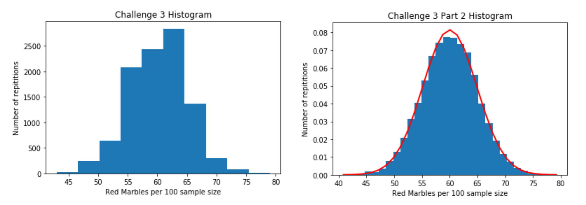

# Level of Detail

## Instructions

### Part I

*Using the KEGG REST API `(http://rest.kegg.jp/list/hsa)`, I wrote a script to obtain a gene dictionary where the keys are all the unique gene names, and the entries are dictionaries with three fields: 
	1. List of synonym gene names
	2. Gene description 
	3. Hsa identifier 

  

### Part II

* I used pandas to load `cubic.xlsx` and then polyfit from numPy to fit a cubic to the data.
  

### Part III

* I generated a bin of red and green marbles where the probability of picking a red marble is 0.6. My script simulated picking a random sample of 100 marbles.

* Next, I repeated generating a sample like that 10,000 times and stored each sample in a list called ‘List_of_samples’

* For each of the 10,000 simulations of picking samples of size 100, I counted the number of red marbles in the sample and stored that in a separate list. I plotted a histogram showing the distribution of the number of red marbles in a random sample of 100 using matplotlib and the hist() function. 

  

