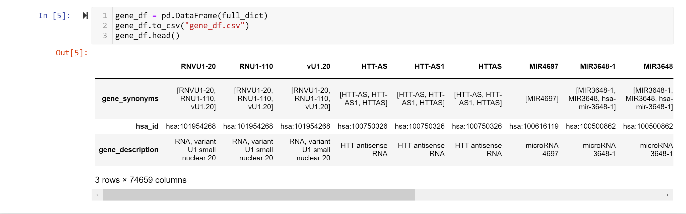
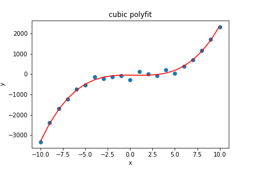

# Level of Detail

## Instructions

### Part I

*Using the KEGG REST API `(http://rest.kegg.jp/list/hsa)`, write a script to obtain a gene dictionary where the keys are all the unique gene names, and the entries are dictionaries with three fields: 

  

### Part II

* Using pandas, load the data from `cubic.xlsx` and use polyfit from numPy to fit a cubic to the data.
  

### Part III

* CImagine a bin of red and green marbles where the probability of picking a red marble is 0.6. Write a script that will simulate picking a random sample of 100 marbles.

* Now, repeat generating a sample like that 10,000 times and store each sample in another list called ‘List_of_samples’

* For each of the 10,000 simulations of picking samples of size 100, count the number of red marbles in the sample and store that in a separate list. Plot a histogram showing the distribution of the number of red marbles in a random sample of 100 using matplotlib and the hist() function. 

* Remember, that a binomial distribution approximates a normal distribution with mean Np and standard deviation sqrt(Np(1-p)). Generate an array of size 10,000 by picking values from a random normal distribution with the appropriate mean and standard deviation and plot a second histogram. 

  

