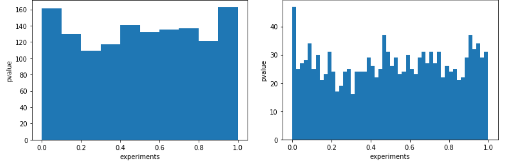

# Level of Detail

## Instructions

### Part I

*Using `SWATH_rawdata.xlsx`, I created a list of dictionarys for the SWATH proteomics data with the following keys.
	1. protein
	2. RYGB
	3. SHAM 

  

### Part II

*  I wrote a function to create a Swarm Plot for each protein where the expression was significantly different between SHAM and RYGB with a p<0.01 cutoff.
	

### Part III

* I created a dataframe of the protein name and the p-value from each t-test comparing SHAM and RYGB.  The histogram shows the significant results are truely significant by having a spike in the lower p-values(shown when I increased the bins).
  

