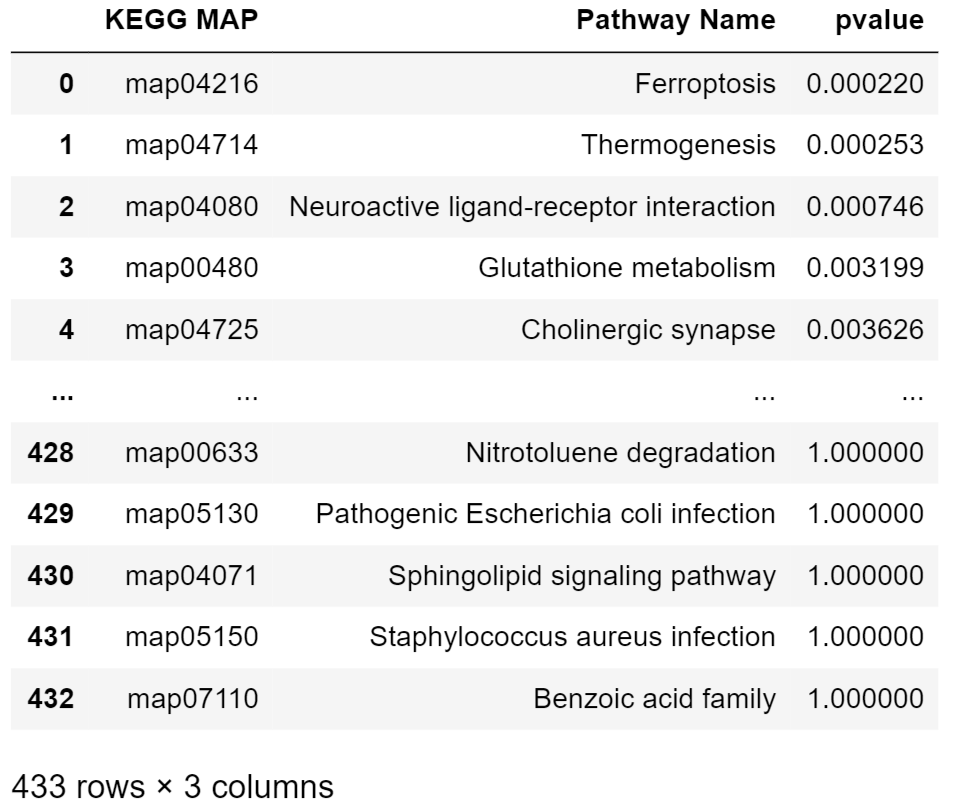
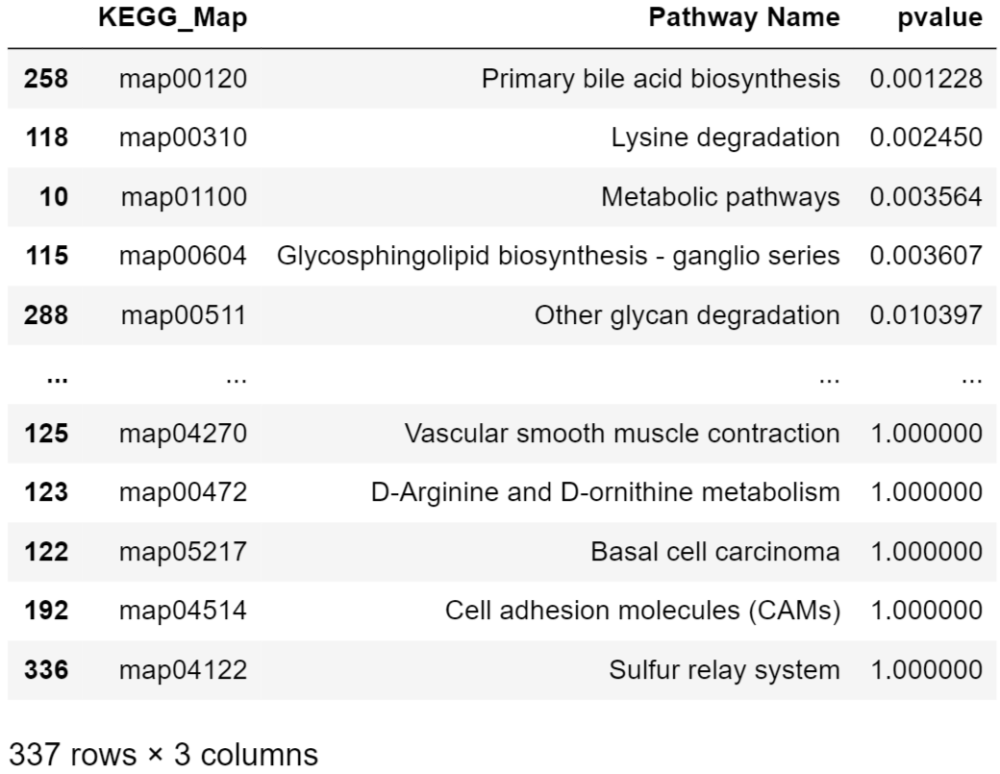
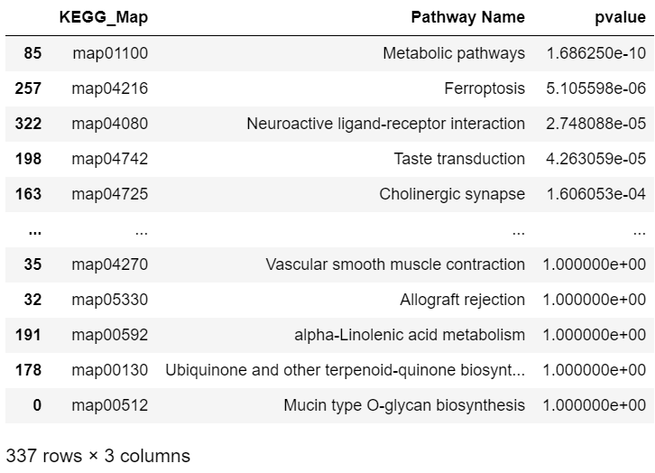

# Level of Detail

## Instructions

### Part I

*I looped through all the metabolic pathways and performed a fisher exact test to see if there was an enrichment of statistically signifiant metabolites in each KEGG pathway.  The output is a pandas dataframe with:
	1. KEGG map ID
	2. KEGG pathway name
	3. p-value from fisher exact test.

  

### Part II

* I repeated the Pathway Enrichment Analysis for the SWATH proteomics data. 

### Part III

* Finally treated the metabolites and proteins as biomolecules that can belong to a pathway and repeated the pathway enrichment analysis on this combined dataset to determine which pathways are enriched in statistically significant biomolecules.
  

